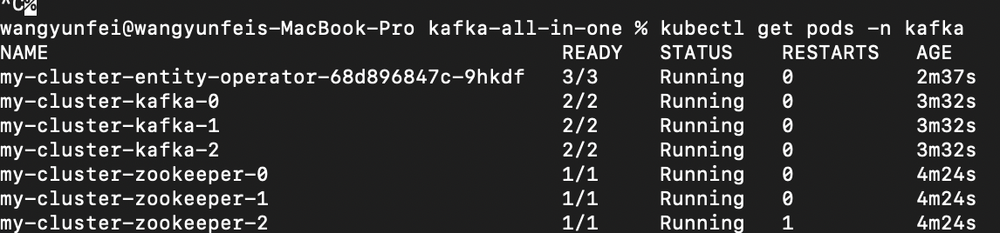
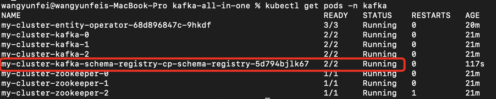
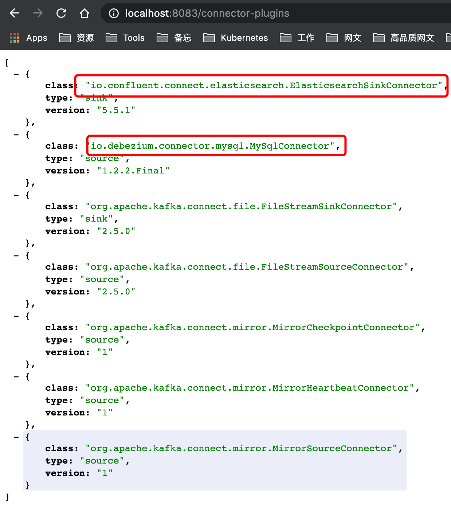
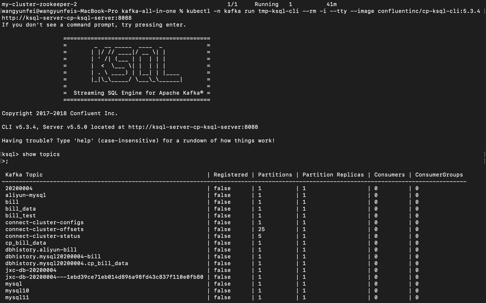

本文基于K8s集群安装了Kafka、Kafka Connect、 Schema Registry、KsqlDB

## 1. 安装Operator Lifecycle Manager

- 下载文件

  https://github.com/operator-framework/operator-lifecycle-manager/releases/download/0.16.1/crds.yaml

  https://github.com/operator-framework/operator-lifecycle-manager/releases/download/0.16.1/olm.yaml

- 安装

  ```shell
  kubectl apply -f https://github.com/operator-framework/operator-lifecycle-manager/releases/download/0.16.1/crds.yaml
  kubectl apply -f https://github.com/operator-framework/operator-lifecycle-manager/releases/download/0.16.1/olm.yaml
  ```

## 2. 安装Strimzi Apache Kafka Operator

- 下载文件：https://operatorhub.io/install/strimzi-kafka-operator.yaml

- 安装命令

  ```shell
  cd kafka
  kubectl create -f strimzi-kafka-operator.yaml
  ```

- 观察安装是否成功

  ```shell
  kubectl get csv -n operators -w
  ```

- 结果显示如下表示安装成功

  ```
  NAME                               DISPLAY   VERSION   REPLACES                           PHASE
  strimzi-cluster-operator.v0.19.0   Strimzi   0.19.0    strimzi-cluster-operator.v0.18.0   Succeeded
  ```

## 3. 安装Kafka集群

- 下载https://raw.githubusercontent.com/strimzi/strimzi-kafka-operator/0.19.0/examples/kafka/kafka-persistent.yaml

- 编辑如下

  ```yaml
  apiVersion: kafka.strimzi.io/v1beta1
  kind: Kafka
  metadata:
    name: my-cluster
  spec:
    kafka:
      version: 2.5.0
      replicas: 3
      listeners:
        plain: {}
        tls: {}
      config:
        offsets.topic.replication.factor: 3
        transaction.state.log.replication.factor: 3
        delete.topic.enable: "true"
        transaction.state.log.min.isr: 2
        log.message.format.version: "2.5"
      storage:
        type: jbod
        volumes:
        - id: 0
          type: persistent-claim
          size: 100Gi
          deleteClaim: false
          class: fast #k8s集群需配置这个StorageClass
    zookeeper:
      replicas: 3
      storage:
        type: persistent-claim
        size: 100Gi
        deleteClaim: false
        class: fast #k8s集群需配置这个StorageClass
    entityOperator:
      topicOperator: {}
      userOperator: {}
  ```

- 安装

  ``` shell
  $ kubectl create namespace kafka
  $ kubectl apply -f kafka-persistent.yml -n kafka 
  ```

- 观察是否安装成功

  ```shell
  kubectl get pods -n kafka 
  ```

  

## 4. 准备Helm Charts

Strimzi不支持安装schema registry和KsqlDB，所以我们通过下载https://github.com/confluentinc/cp-helm-charts来安装。在其`charts`目录下的`cp-schema-registry`和`cp-ksql-server`即我们所需要的Helm Charts。

## 5. 安装Schema Registry

- 安装

  在`cp-schema-registry`目录下，执行：

  ```shell
  helm install my-cluster-kafka-schema-registry --set kafka.bootstrapServers="PLAINTEXT://my-cluster-kafka-bootstrap:9092" . -n kafka
  ```

- 查看是否安装成功

  ```shell
  kubectl get pods -n kafka
  ```

  

## 6. 安装Kafka Connect

- 下载文件https://raw.githubusercontent.com/strimzi/strimzi-kafka-operator/0.19.0/examples/connect/kafka-connect.yaml，修改编写如下

  ```yaml
  apiVersion: kafka.strimzi.io/v1beta1
  kind: KafkaConnect
  metadata:
    name: my-connect-cluster
  #  annotations:
  #  # use-connector-resources configures this KafkaConnect
  #  # to use KafkaConnector resources to avoid
  #  # needing to call the Connect REST API directly
  #    strimzi.io/use-connector-resources: "true"
  spec:
    version: 2.5.0
    replicas: 1
    bootstrapServers: my-cluster-kafka-bootstrap:9093
    image: registry.cn-shanghai.aliyuncs.com/wiselyman/kafka-connect-mysql-es:4
    tls:
      trustedCertificates:
        - secretName: my-cluster-cluster-ca-cert
          certificate: ca.crt
    config:
      group.id: connect-cluster
      offset.storage.topic: connect-cluster-offsets
      config.storage.topic: connect-cluster-configs
      status.storage.topic: connect-cluster-status
      schema.registry.url: http://my-cluster-kafka-schema-registry-cp-schema-registry:8081
      key.converter: io.confluent.connect.avro.AvroConverter
      key.converter.schema.registry.url: http://my-cluster-kafka-schema-registry-cp-schema-registry:8081
      value.converter: io.confluent.connect.avro.AvroConverter
      value.converter.schema.registry.url: http://my-cluster-kafka-schema-registry-cp-schema-registry:8081
  ```

  > `registry.cn-shanghai.aliyuncs.com/wiselyman/kafka-connect-mysql-es:0.19.0-kafka-2.5.0`源码位于https://github.com/wiselyman/docker-images/tree/master/kafka-connect/0.19.0-kafka-2.5.0/mysql-es，本镜像集成了Debezium Mysq Connector和Elasticsearch Connector和Kafka Connect Avro Converter，定制镜像请参考https://github.com/wiselyman/kafka-in-battle#521-%E5%87%86%E5%A4%87kafka-connect%E9%95%9C%E5%83%8F

- 安装

  ```shell
  kubectl apply -f kafka-connect.yaml -n kafka
  ```

- 本地代理访问kafka connect访问端口

  ```shell
  kubectl port-forward service/my-connect-cluster-connect-api 8083:8083 -n kafka
  ```

- 查看已安装的Connectors，使用Get访问http://localhost:8083/connector-plugins：

  

  

## 7. 安装KsqlDB

- 修改ksqldb的外部Connect连接设置，`cp-ksql-server/templates/deployment.yaml`,添加变量：

  ```yaml 
            env:
            - name: KSQL_BOOTSTRAP_SERVERS
              value: {{ template "cp-ksql-server.kafka.bootstrapServers" . }}
            - name: KSQL_KSQL_SERVICE_ID
              value: {{ template "cp-ksql-server.serviceId" . }}
            - name: KSQL_KSQL_SCHEMA_REGISTRY_URL
              value: {{ template "cp-ksql-server.cp-schema-registry.service-name" . }}
            - name: KSQL_HEAP_OPTS
              value: "{{ .Values.heapOptions }}"
            - name: KSQL_KSQL_CONNECT_URL # 添加此属性，使用connectUrl变量连接
              value: "{{ .Values.connectUrl }}"
  ```

- 安装

  在`cp-ksql-server`目录下，执行：

  ```shell
  helm install ksql-server --set cp-schema-registry.url="http://my-cluster-kafka-schema-registry-cp-schema-registry:8081",kafka.bootstrapServers="PLAINTEXT://my-cluster-kafka-bootstrap:9092",connectUrl="http://my-connect-cluster-connect-api:8083",ksql.headless=false . -n kafka
  ```

- KsqlDB客户端

  ```shell
  kubectl -n kafka run tmp-ksql-cli --rm -i --tty --image confluentinc/cp-ksql-cli:5.4.2 http://ksql-server-cp-ksql-server:8088
  ```

  