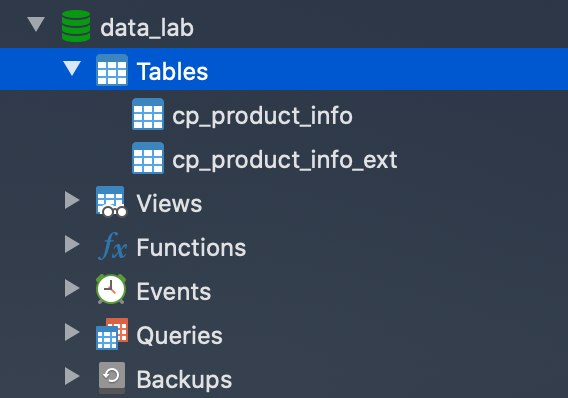
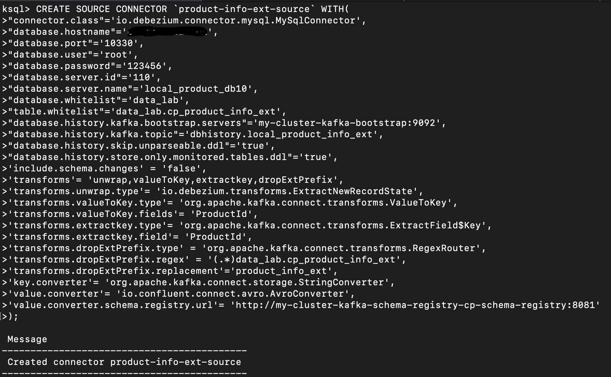

# 基于KSqlDB的ETL流程

当前需求为，在遗留数据库MySQL中有些数据需要通过经过一定的处理后，存入到ElasticSearch中。

工作条件：

- MySQL：作为数据来源

- Kafka（KSqlDB、Kafka Connect、Schema Registry）：数据处理平台

- ElasticSearch：最终数据目的地，ElasticSearch中的数据可实现中文和拼音分词

工作流程：

- 通过Kafka Connect的Source Connector（Debezium Mysq Connector）将MySQL的两张表的数据导入到Kafka Topic；
- 通过KSqlDB将两个Topic创建成表（KSqlDB的表），用SQL方式进行处理，并合并到一个Topic中；
- 最后通过Kafka Connect的Sink Connector（Elasticsearch Connector）将Topic的数据导出到ElasticSearch；

## 1. 工作准备

### 1.1 MYSQL准备工作

#### 1.1.1 MySQL数据库服务器准备

- 查看bin-log是否激活

  ```shell
  $ /usr/local/mysql/bin
  $ ./mysqladmin variables -uroot -p123456|grep log_bin
  ```

- 修改my.cnf

  ```shell
  vi /etc/my.cnf 
  ```

  添加

  ```ini
  [mysqld]
  server-id = 42
  log_bin = mysql-bin
  binlog_format = row
  binlog_row_image = minimal
  expire_logs_days = 10
  ```


#### 1.1.2 被导入的表准备



- 商品明细表`cp_product_info`:

  ```sql
  CREATE TABLE `cp_product_info` (
    `ProductId` varchar(50) NOT NULL,
    `ProductName` varchar(255) DEFAULT NULL,
    PRIMARY KEY (`ProductId`)
  ) ENGINE=InnoDB DEFAULT CHARSET=utf8mb4;
  ```

- 商品扩展表`cp_product_info_ext`:

  ```sql
  CREATE TABLE `cp_product_info_ext` (
    `Id` varchar(50) NOT NULL,
    `ProductId` varchar(50) DEFAULT NULL,
    `BarCode1` varchar(255) DEFAULT NULL,
    `BarCode2` varchar(255) DEFAULT NULL,
    `BarCode3` varchar(255) DEFAULT NULL,
    `BarCode4` varchar(255) DEFAULT NULL,
    `PropertyText1` varchar(255) DEFAULT NULL,
    `PropertyText2` varchar(255) DEFAULT NULL,
    `PropertyText3` varchar(255) DEFAULT NULL,
    `PropertyText4` varchar(255) DEFAULT NULL,
    `PropertyText5` varchar(255) DEFAULT NULL,
    PRIMARY KEY (`Id`)
  ) ENGINE=InnoDB DEFAULT CHARSET=utf8mb4;
  ```

- 插入测试数据

  ```sql
  INSERT INTO `cp_product_info` VALUES ('257818FF-D455-4F46-8FD0-507BA5348054', '洗面奶');
  INSERT INTO `cp_product_info` VALUES ('5A0792B4-D858-4291-8BCB-141FD4470FF0', '床');
  INSERT INTO `cp_product_info` VALUES ('B8DBD875-7271-48FA-9606-5404BF2E0C02', '床');
  INSERT INTO `cp_product_info` VALUES ('B9A80684-8185-426E-9FFF-E874E58CC43A', '床');
  INSERT INTO `cp_product_info` VALUES ('EA07B6CA-4564-4F0E-9B35-368FE395EEED', '带线插板');
  
  INSERT INTO `cp_product_info_ext` VALUES ('012801F8-8B84-4AE1-88D2-0F2BE0EC85E3', 'B9A80684-8185-426E-9FFF-E874E58CC43A', NULL, NULL, NULL, NULL, '6602#', NULL, '胡+白', NULL, NULL);
  INSERT INTO `cp_product_info_ext` VALUES ('013736CE-235C-45B2-A6CA-27FBC02315DA', 'B8DBD875-7271-48FA-9606-5404BF2E0C02', NULL, NULL, NULL, NULL, '9933#', NULL, '深胡', NULL, NULL);
  INSERT INTO `cp_product_info_ext` VALUES ('01A4D983-B2DE-44E2-BB95-30382D078FD3', '5A0792B4-D858-4291-8BCB-141FD4470FF0', NULL, NULL, NULL, NULL, '9953#', NULL, '胡桃色', NULL, NULL);
  INSERT INTO `cp_product_info_ext` VALUES ('B534A2BB-3C66-48B3-883A-9BEA1F2024E5', '257818FF-D455-4F46-8FD0-507BA5348054', '6971469540243', NULL, NULL, NULL, NULL, NULL, NULL, NULL, NULL);
  INSERT INTO `cp_product_info_ext` VALUES ('B9F166B3-3C40-4B3D-BC20-C8C8249F4F05', 'EA07B6CA-4564-4F0E-9B35-368FE395EEED', '6971928510275', NULL, NULL, NULL, NULL, NULL, NULL, NULL, NULL);
  ```

- 业务关系

  商品信息表和商品扩展表是一一对应的关系，可通过`ProductId`字段关联。

### 1.2 Kakfa集群

#### 1.2.1 Kafka全家桶安装

[1-Kafka-installation.md](1-Kafka-installation.md)

#### 1.2.2 简单测试KSqlDB

- 启动KsqlDB客户端

  ```shell
  kubectl -n kafka run tmp-ksql-cli --rm -i --tty --image confluentinc/cp-ksql-cli:5.4.2 http://ksql-server-cp-ksql-server:8088
  ```

  

- 设置从kafka topic开始读取数据

  ```sql
  SET 'auto.offset.reset' = 'earliest';
  ```

- 创建STREAM

  ```sql
  CREATE STREAM users ( 
  	ROWKEY INT KEY, 
  	USERNAME VARCHAR
  ) WITH ( 
  	KAFKA_TOPIC='users', 
  	VALUE_FORMAT='JSON',
    PARTITIONS=1,
    REPLICAS=1
  );
  ```

- 插入测试数据

  ```sql
  INSERT INTO users (username) VALUES ('wang');
  INSERT INTO users (username) VALUES ('yun');
  INSERT INTO users (username) VALUES ('fei');
  INSERT INTO users (username) VALUES ('wang');
  ```

- 使用push query（通过`EMIT CHANGES`）查询数据

  ```sql
  SELECT 'Hello, ' + USERNAME AS GREETING 
  FROM users
  EMIT CHANGES;
  ```

  

### 1.3 ElasticSearch安装

- 安装helm：https://helm.sh/docs/intro/install/

- 添加**腾讯云**应用仓库

  ```
  helm repo add tkemarket https://market-tke.tencentcloudcr.com/chartrepo/opensource-stable
  helm repo update
  ```

- 配置ES

  ```yaml
  image: "registry.cn-shanghai.aliyuncs.com/wiselyman/elasticsearch-chinese"
  imageTag: "7.6.2"
  imagePullPolicy: "Always"
  volumeClaimTemplate:
    storageClassName: "fast"
  service:
    type: NodePort
  replicas: 1
  ```

  此处为定制的elasticsearch镜像，安装了中文分词、拼音分词、简繁体转换插件，源码：[https://github.com/wiselyman/docker-images/blob/master/elasticsearch/7.6.2/Dockerfile](https://github.com/wiselyman/docker-images/blob/master/elasticsearch/7.6.2/Dockerfile)。

- 安装

  ```shell
  helm install -f es.yaml my-es tkemarket/elasticsearch
  ```

- 代理访问ES

  ```
  kubectl port-forward service/elasticsearch-master 9200:9200
  ```

  


## 2. 数据ETL

### 2.1 Extraction数据抽取（Source Connector）

#### 2.1.1 导入cp_product_info的Connector

```sql
CREATE SOURCE CONNECTOR `product-info-source` WITH( 
"connector.class"='io.debezium.connector.mysql.MySqlConnector', 
"database.hostname"='数据库地址',
"database.port"='10330',
"database.user"='root',
"database.password"='123456',
"database.server.id"='109',
"database.server.name"='local_product_db9',
"database.whitelist"='data_lab',
"table.whitelist"='data_lab.cp_product_info',
"database.history.kafka.bootstrap.servers"='my-cluster-kafka-bootstrap:9092',
"database.history.kafka.topic"='dbhistory.local_product_info',
"database.history.skip.unparseable.ddl"='true',
"database.history.store.only.monitored.tables.ddl"='true',                                         
'include.schema.changes' = 'false',
'transforms'= 'unwrap,extractkey,dropInfoPrefix',
'transforms.unwrap.type'= 'io.debezium.transforms.ExtractNewRecordState',
'transforms.extractkey.type'= 'org.apache.kafka.connect.transforms.ExtractField$Key',
'transforms.extractkey.field'= 'ProductId',
'transforms.dropInfoPrefix.type' = 'org.apache.kafka.connect.transforms.RegexRouter',
'transforms.dropInfoPrefix.regex' = '(.*)data_lab.cp_product_info',
'transforms.dropInfoPrefix.replacement'='product_info',
'key.converter'= 'org.apache.kafka.connect.storage.StringConverter',
'value.converter'= 'io.confluent.connect.avro.AvroConverter',
'value.converter.schema.registry.url'= 'http://my-cluster-kafka-schema-registry-cp-schema-registry:8081'
);
```

说明：

- 1.`"database.server.id"='109'`、`"database.server.name"='local_product_db9'`,不同的connector必须唯一

- 2.`"database.history.skip.unparseable.ddl"='true'`:解析错误的sql略过

- 3.`"database.history.store.only.monitored.tables.ddl"='true'`,   只监控要导的表的ddl

- 4.将ROWKEY结构中的`ProductId`提取出来作为ROWKEY

  ```properties
  'transforms.extractkey.type'= 'org.apache.kafka.connect.transforms.ExtractField$Key',
  'transforms.extractkey.field'= 'ProductId',
  ```

- 5.将默认生成的带前缀的topic名称修改为`product_info`

  ```properties
  'transforms.dropInfoPrefix.type' = 'org.apache.kafka.connect.transforms.RegexRouter',
  'transforms.dropInfoPrefix.regex' = '(.*)data_lab.cp_product_info',
  'transforms.dropInfoPrefix.replacement'='product_info',
  ```


#### 2.1.2 导入cp_product_info_ext的Connector

```sql
CREATE SOURCE CONNECTOR `product-info-ext-source` WITH( 
"connector.class"='io.debezium.connector.mysql.MySqlConnector', 
"database.hostname"='数据库地址',
"database.port"='10330',
"database.user"='root',
"database.password"='123456',
"database.server.id"='110',
"database.server.name"='local_product_db10',
"database.whitelist"='data_lab',
"table.whitelist"='data_lab.cp_product_info_ext',
"database.history.kafka.bootstrap.servers"='my-cluster-kafka-bootstrap:9092',
"database.history.kafka.topic"='dbhistory.local_product_info_ext',
"database.history.skip.unparseable.ddl"='true',
"database.history.store.only.monitored.tables.ddl"='true',                                         
'include.schema.changes' = 'false',
'transforms'= 'unwrap,valueToKey,extractkey,dropExtPrefix',
'transforms.unwrap.type'= 'io.debezium.transforms.ExtractNewRecordState',
'transforms.valueToKey.type'= 'org.apache.kafka.connect.transforms.ValueToKey',
'transforms.valueToKey.fields'= 'ProductId',
'transforms.extractkey.type'= 'org.apache.kafka.connect.transforms.ExtractField$Key',
'transforms.extractkey.field'= 'ProductId',
'transforms.dropExtPrefix.type' = 'org.apache.kafka.connect.transforms.RegexRouter',
'transforms.dropExtPrefix.regex' = '(.*)data_lab.cp_product_info_ext',
'transforms.dropExtPrefix.replacement'='product_info_ext',
'key.converter'= 'org.apache.kafka.connect.storage.StringConverter',
'value.converter'= 'io.confluent.connect.avro.AvroConverter',
'value.converter.schema.registry.url'= 'http://my-cluster-kafka-schema-registry-cp-schema-registry:8081'
);
```

- 1. 将值中的ProductId转换并存储到ROWKEY的结果中

  ```properties
  'transforms.valueToKey.type'= 'org.apache.kafka.connect.transforms.ValueToKey',
  'transforms.valueToKey.fields'= 'ProductId',
  ```

- 2.然后将ROWKEY结构中的`ProductId`提取出来作为ROWKEY

  ```properties
  'transforms.extractkey.type'= 'org.apache.kafka.connect.transforms.ExtractField$Key',
  'transforms.extractkey.field'= 'ProductId',
  ```



#### 2.1.3 查看Connector情况

- 查看已有的connectors

  ```sql
  show connectors;
  ```

  

- 描述connector

  ```sql
  describe connector `product-info-source`;
  describe connector `product-info-ext-source`;
  ```

  

- 查看当前生成的topics

  ```sql
  show topics
  ```
  
  

- 查看导入到topics中的数据

  ```sql
  SET 'auto.offset.reset' = 'earliest';
  print `product_info`;
  print `product_info_ext`;
  ```

  

### 2.2 Transform数据转换（KSqlDB）

#### 2.2.1 创建KSqlDB表

- 从topic`product_info`创建表`product_info`，在KSQL控制台执行

  ```sql
  CREATE TABLE product_info  WITH (
      KAFKA_TOPIC = 'product_info',
      VALUE_FORMAT='AVRO'
  );
  ```

  ` VALUE_FORMAT='AVRO'`的设置可以从上面执行打印topic命令中可以看到应该设置成什么：

  ```sql
  print `product_info`;
  ```

  

  

- 从topic`product_info_ext`创建表`product_info_ext`，在KSQL控制台执行

  ```sql
  CREATE TABLE PRODUCT_INFO_EXT WITH (
      KAFKA_TOPIC = 'product_info_ext',
      VALUE_FORMAT='AVRO'
  );
  ```

  

- 显示表格

  ```sql
  show tables;
  ```

  

- 显示表格数据

  ```sql
  select * from `PRODUCT_INFO` emit changes;
  select * from `PRODUCT_INFO_EXT` emit changes;
  ```

  

  

  从上面两张图可以看出，现在的ROWKEY都是PRODUCTID，我们可以通过ROWKEY来进行两张表的关联

#### 2.2.2 创建新表join数据

- 创建新表`PRODUCT`

  ```sql
  CREATE TABLE PRODUCT 
  	WITH(KAFKA_TOPIC='product')
  	AS 
  SELECT
  I.PRODUCTID, I.PRODUCTNAME,
  E.BARCODE1,E.BARCODE2,E.BARCODE3,E.BARCODE4,
  E.PROPERTYTEXT1,E.PROPERTYTEXT2,E.PROPERTYTEXT3,E.PROPERTYTEXT4,E.PROPERTYTEXT5
  FROM PRODUCT_INFO I
  		 INNER JOIN PRODUCT_INFO_EXT E
  		 	ON I.ROWKEY = E.ROWKEY;
  ```

  表的记录存储在`KAFKA_TOPIC='product'`中：

  

- 查看合并的数据

  ```
  select * from `PRODUCT` emit changes;
  ```

  

- 查看topic `product`中的数据

  ```sql
  print `product`;
  ```

  

### 2.3 Load数据载入（Sink Connector）

#### 2.3.1 设置ElasticSearch动态映射模版

向端点[http://localhost:9200/_template/kafkaconnect/](http://localhost:9200/_template/kafkaconnect/)，发送PUT请求：

```json
{
  "index_patterns": "*",
  "settings": {
    "number_of_shards": 1,
    "number_of_replicas": 0,
    "analysis": {
      "char_filter": {
        "t2s_char_convert": {
          "type": "stconvert",
          "convert_type": "t2s"
        }
      },
      "filter": {
        "pinyin_filter": {
          "type": "pinyin",
          "keep_first_letter": false,
          "keep_separate_first_letter": false,
          "keep_full_pinyin": false,
          "keep_joined_full_pinyin": true,
          "keep_none_chinese": true,
          "keep_none_chinese_together": true,
          "keep_none_chinese_in_first_letter": true,
          "keep_none_chinese_in_joined_full_pinyin": true,
          "none_chinese_pinyin_tokenize": false,
          "lowercase": true
        }
      },
      "analyzer": {
        "es_ik_analyzer": {
          "type": "custom",
          "char_filter": [
            "t2s_char_convert"
          ],
          "tokenizer": "ik_smart",
          "filter": [
            "lowercase",
            "stemmer"
          ]
        },
        "es_pinyin_analyzer": {
          "type": "custom",
          "char_filter": [
            "t2s_char_convert"
          ],
          "tokenizer": "ik_smart",
          "filter": [
            "lowercase",
            "pinyin_filter"
          ]
        }
      }
    }
  },
  "mappings": {
      "dynamic_templates": [
        {"productName": {
            "match_mapping_type": "string",
            "match": "PRODUCTNAME",
            "mapping": {
              "type": "text",
              "fields": {
                "ik": {
                  "type": "text",
                  "analyzer": "es_ik_analyzer"
                },
                "pinyin": {
                  "type": "text",
                  "analyzer": "es_pinyin_analyzer"
                }
              }
            }
          }
        },
        {"propertyTexts": {
            "match_mapping_type": "string",
            "match": "PROPERTYTEXT*",
            "mapping": {
              "type": "text",
              "fields": {
                "ik": {
                  "type": "text",
                  "analyzer": "es_ik_analyzer"
                },
                "pinyin": {
                  "type": "text",
                  "analyzer": "es_pinyin_analyzer"
                }
              }
            }
          }
        }
      ]

  }
}

```


#### 2.3.2 导出到ES的Connector

```sql
CREATE SINK CONNECTOR `product-sink` WITH (
    'connector.class' = 'io.confluent.connect.elasticsearch.ElasticsearchSinkConnector',
    'topics'          = 'product',
    'connection.url'  = 'http://elasticsearch-master.default.svc.cluster.local:9200',
    'type.name'       = '_doc',
    'key.ignore'      = 'false',
    'schema.ignore'   = 'true'
);
```

#### 2.3.3 Elasticsearch中的结果

- Elasticsearch中的数据，使用GET请求访问`http://localhost:9200/product/_search?size=1000&q=*:*`

  

- 根据动态映射模版生成的索引schema，使用GET请求访问[http://localhost:9200/product/_mapping](http://localhost:9200/product/_mapping)

  

  

