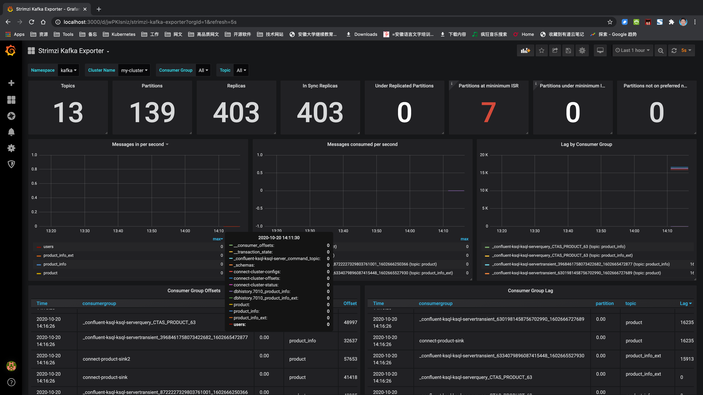

在Strimzi提供的监控方案主要有**Prometheus JMX Exporter**和**Strimzi Kafka Exporter**，使用Prometheus将这些指标数据（metrics）读取，然后通过Grafana将Prometheus作为数据源展示出来作为监控。

- 本例需在[Kafka全家桶安装](1-Kafka-installation.md)之后进行。

- Strimizi源码可在此页面选择最新版本下载：https://strimzi.io/downloads/，Strimizi源码本例0.19.0版本下载地址：https://github.com/strimzi/strimzi-kafka-operator/releases/download/0.19.0/strimzi-0.19.0.zip

## 1.Prometheus JMX Exporter

### 1.1 更新部署Kafka集群

#### 1.1.1 更新部署Kafka集群metrics配置

- 参考例子`strimzi-0.19.0/examples/metrics/kafka-metrics.yaml`，为我们前面部署的`kafka-persistent.yml`添加`metrics`配置：

  ```yaml
  apiVersion: kafka.strimzi.io/v1beta1
  kind: Kafka
  metadata:
    name: my-cluster
  spec:
    kafka:
      version: 2.5.0
      replicas: 3
      listeners:
        plain: {}
        tls: {}
      config:
        offsets.topic.replication.factor: 3
        transaction.state.log.replication.factor: 3
        delete.topic.enable: "true"
        transaction.state.log.min.isr: 2
        log.message.format.version: "2.5"
      storage:
        type: jbod
        volumes:
        - id: 0
          type: persistent-claim
          size: 100Gi
          deleteClaim: false
          class: fast
      metrics:
        # Inspired by config from Kafka 2.0.0 example rules:
        # https://github.com/prometheus/jmx_exporter/blob/master/example_configs/kafka-2_0_0.yml
        lowercaseOutputName: true
        rules:
          # Special cases and very specific rules
          - pattern : kafka.server<type=(.+), name=(.+), clientId=(.+), topic=(.+), partition=(.*)><>Value
            name: kafka_server_$1_$2
            type: GAUGE
            labels:
              clientId: "$3"
              topic: "$4"
              partition: "$5"
          - pattern : kafka.server<type=(.+), name=(.+), clientId=(.+), brokerHost=(.+), brokerPort=(.+)><>Value
            name: kafka_server_$1_$2
            type: GAUGE
            labels:
              clientId: "$3"
              broker: "$4:$5"
          # Some percent metrics use MeanRate attribute
          # Ex) kafka.server<type=(KafkaRequestHandlerPool), name=(RequestHandlerAvgIdlePercent)><>MeanRate
          - pattern: kafka.(\w+)<type=(.+), name=(.+)Percent\w*><>MeanRate
            name: kafka_$1_$2_$3_percent
            type: GAUGE
          # Generic gauges for percents
          - pattern: kafka.(\w+)<type=(.+), name=(.+)Percent\w*><>Value
            name: kafka_$1_$2_$3_percent
            type: GAUGE
          - pattern: kafka.(\w+)<type=(.+), name=(.+)Percent\w*, (.+)=(.+)><>Value
            name: kafka_$1_$2_$3_percent
            type: GAUGE
            labels:
              "$4": "$5"
          # Generic per-second counters with 0-2 key/value pairs
          - pattern: kafka.(\w+)<type=(.+), name=(.+)PerSec\w*, (.+)=(.+), (.+)=(.+)><>Count
            name: kafka_$1_$2_$3_total
            type: COUNTER
            labels:
              "$4": "$5"
              "$6": "$7"
          - pattern: kafka.(\w+)<type=(.+), name=(.+)PerSec\w*, (.+)=(.+)><>Count
            name: kafka_$1_$2_$3_total
            type: COUNTER
            labels:
              "$4": "$5"
          - pattern: kafka.(\w+)<type=(.+), name=(.+)PerSec\w*><>Count
            name: kafka_$1_$2_$3_total
            type: COUNTER
          # Generic gauges with 0-2 key/value pairs
          - pattern: kafka.(\w+)<type=(.+), name=(.+), (.+)=(.+), (.+)=(.+)><>Value
            name: kafka_$1_$2_$3
            type: GAUGE
            labels:
              "$4": "$5"
              "$6": "$7"
          - pattern: kafka.(\w+)<type=(.+), name=(.+), (.+)=(.+)><>Value
            name: kafka_$1_$2_$3
            type: GAUGE
            labels:
              "$4": "$5"
          - pattern: kafka.(\w+)<type=(.+), name=(.+)><>Value
            name: kafka_$1_$2_$3
            type: GAUGE
          # Emulate Prometheus 'Summary' metrics for the exported 'Histogram's.
          # Note that these are missing the '_sum' metric!
          - pattern: kafka.(\w+)<type=(.+), name=(.+), (.+)=(.+), (.+)=(.+)><>Count
            name: kafka_$1_$2_$3_count
            type: COUNTER
            labels:
              "$4": "$5"
              "$6": "$7"
          - pattern: kafka.(\w+)<type=(.+), name=(.+), (.+)=(.*), (.+)=(.+)><>(\d+)thPercentile
            name: kafka_$1_$2_$3
            type: GAUGE
            labels:
              "$4": "$5"
              "$6": "$7"
              quantile: "0.$8"
          - pattern: kafka.(\w+)<type=(.+), name=(.+), (.+)=(.+)><>Count
            name: kafka_$1_$2_$3_count
            type: COUNTER
            labels:
              "$4": "$5"
          - pattern: kafka.(\w+)<type=(.+), name=(.+), (.+)=(.*)><>(\d+)thPercentile
            name: kafka_$1_$2_$3
            type: GAUGE
            labels:
              "$4": "$5"
              quantile: "0.$6"
          - pattern: kafka.(\w+)<type=(.+), name=(.+)><>Count
            name: kafka_$1_$2_$3_count
            type: COUNTER
          - pattern: kafka.(\w+)<type=(.+), name=(.+)><>(\d+)thPercentile
            name: kafka_$1_$2_$3
            type: GAUGE
            labels:
              quantile: "0.$4"
    zookeeper:
      replicas: 3
      storage:
        type: persistent-claim
        size: 100Gi
        deleteClaim: false
        class: fast
      metrics:
        # Inspired by Zookeeper rules
        # https://github.com/prometheus/jmx_exporter/blob/master/example_configs/zookeeper.yaml
        lowercaseOutputName: true
        rules:
          # replicated Zookeeper
          - pattern: "org.apache.ZooKeeperService<name0=ReplicatedServer_id(\\d+)><>(\\w+)"
            name: "zookeeper_$2"
            type: GAUGE
          - pattern: "org.apache.ZooKeeperService<name0=ReplicatedServer_id(\\d+), name1=replica.(\\d+)><>(\\w+)"
            name: "zookeeper_$3"
            type: GAUGE
            labels:
              replicaId: "$2"
          - pattern: "org.apache.ZooKeeperService<name0=ReplicatedServer_id(\\d+), name1=replica.(\\d+), name2=(\\w+)><>(Packets\\w+)"
            name: "zookeeper_$4"
            type: COUNTER
            labels:
              replicaId: "$2"
              memberType: "$3"
          - pattern: "org.apache.ZooKeeperService<name0=ReplicatedServer_id(\\d+), name1=replica.(\\d+), name2=(\\w+)><>(\\w+)"
            name: "zookeeper_$4"
            type: GAUGE
            labels:
              replicaId: "$2"
              memberType: "$3"
          - pattern: "org.apache.ZooKeeperService<name0=ReplicatedServer_id(\\d+), name1=replica.(\\d+), name2=(\\w+), name3=(\\w+)><>(\\w+)"
            name: "zookeeper_$4_$5"
            type: GAUGE
            labels:
              replicaId: "$2"
              memberType: "$3"
          # standalone Zookeeper
          - pattern: "org.apache.ZooKeeperService<name0=StandaloneServer_port(\\d+)><>(\\w+)"
            type: GAUGE
            name: "zookeeper_$2"
          - pattern: "org.apache.ZooKeeperService<name0=StandaloneServer_port(\\d+), name1=InMemoryDataTree><>(\\w+)"
            type: GAUGE
            name: "zookeeper_$2"
    entityOperator:
      topicOperator: {}
      userOperator: {}
  ```

- 更新部署

  ```shell
  kubectl apply -f kafka-persistent.yml -n kafka
  ```

#### 1.1.2 更新部署Kafka Connect集群metrics配置

- 根据`strimzi-0.19.0/examples/metrics/kafka-connect-metrics.yaml`修改`kafka-connect.yaml`，增加`metrics`配置：

  ```yaml
  apiVersion: kafka.strimzi.io/v1beta1
  kind: KafkaConnect
  metadata:
    name: my-connect-cluster
  #  annotations:
  #  # use-connector-resources configures this KafkaConnect
  #  # to use KafkaConnector resources to avoid
  #  # needing to call the Connect REST API directly
  #    strimzi.io/use-connector-resources: "true"
  spec:
    version: 2.5.0
    replicas: 1
    bootstrapServers: my-cluster-kafka-bootstrap:9093
    image: registry.cn-shanghai.aliyuncs.com/wiselyman/kafka-connect-mysql-es:4
    tls:
      trustedCertificates:
        - secretName: my-cluster-cluster-ca-cert
          certificate: ca.crt
    config:
      group.id: connect-cluster
      offset.storage.topic: connect-cluster-offsets
      config.storage.topic: connect-cluster-configs
      status.storage.topic: connect-cluster-status
      schema.registry.url: http://my-cluster-kafka-schema-registry-cp-schema-registry:8081
      key.converter: org.apache.kafka.connect.storage.StringConverter
      value.converter: io.confluent.connect.avro.AvroConverter
      value.converter.schema.registry.url: http://my-cluster-kafka-schema-registry-cp-schema-registry:8081
    metrics:
      # Inspired by kafka-connect rules
      # https://github.com/prometheus/jmx_exporter/blob/master/example_configs/kafka-connect.yml
      lowercaseOutputName: true
      lowercaseOutputLabelNames: true
      rules:
        #kafka.connect:type=app-info,client-id="{clientid}"
        #kafka.consumer:type=app-info,client-id="{clientid}"
        #kafka.producer:type=app-info,client-id="{clientid}"
        - pattern: 'kafka.(.+)<type=app-info, client-id=(.+)><>start-time-ms'
          name: kafka_$1_start_time_seconds
          labels:
            clientId: "$2"
          help: "Kafka $1 JMX metric start time seconds"
          type: GAUGE
          valueFactor: 0.001
        - pattern: 'kafka.(.+)<type=app-info, client-id=(.+)><>(commit-id|version): (.+)'
          name: kafka_$1_$3_info
          value: 1
          labels:
            clientId: "$2"
            $3: "$4"
          help: "Kafka $1 JMX metric info version and commit-id"
          type: GAUGE
  
        #kafka.producer:type=producer-topic-metrics,client-id="{clientid}",topic="{topic}"", partition="{partition}"
        #kafka.consumer:type=consumer-fetch-manager-metrics,client-id="{clientid}",topic="{topic}"", partition="{partition}"
        - pattern: kafka.(.+)<type=(.+)-metrics, client-id=(.+), topic=(.+), partition=(.+)><>(.+-total|compression-rate|.+-avg|.+-replica|.+-lag|.+-lead)
          name: kafka_$2_$6
          labels:
            clientId: "$3"
            topic: "$4"
            partition: "$5"
          help: "Kafka $1 JMX metric type $2"
          type: GAUGE
  
        #kafka.producer:type=producer-topic-metrics,client-id="{clientid}",topic="{topic}"
        #kafka.consumer:type=consumer-fetch-manager-metrics,client-id="{clientid}",topic="{topic}"", partition="{partition}"
        - pattern: kafka.(.+)<type=(.+)-metrics, client-id=(.+), topic=(.+)><>(.+-total|compression-rate|.+-avg)
          name: kafka_$2_$5
          labels:
            clientId: "$3"
            topic: "$4"
          help: "Kafka $1 JMX metric type $2"
          type: GAUGE
  
        #kafka.connect:type=connect-node-metrics,client-id="{clientid}",node-id="{nodeid}"
        #kafka.consumer:type=consumer-node-metrics,client-id=consumer-1,node-id="{nodeid}"
        - pattern: kafka.(.+)<type=(.+)-metrics, client-id=(.+), node-id=(.+)><>(.+-total|.+-avg)
          name: kafka_$2_$5
          labels:
            clientId: "$3"
            nodeId: "$4"
          help: "Kafka $1 JMX metric type $2"
          type: UNTYPED
  
        #kafka.connect:type=kafka-metrics-count,client-id="{clientid}"
        #kafka.consumer:type=consumer-fetch-manager-metrics,client-id="{clientid}"
        #kafka.consumer:type=consumer-coordinator-metrics,client-id="{clientid}"
        #kafka.consumer:type=consumer-metrics,client-id="{clientid}"
        - pattern: kafka.(.+)<type=(.+)-metrics, client-id=(.*)><>(.+-total|.+-avg|.+-bytes|.+-count|.+-ratio|.+-age|.+-flight|.+-threads|.+-connectors|.+-tasks|.+-ago)
          name: kafka_$2_$4
          labels:
            clientId: "$3"
          help: "Kafka $1 JMX metric type $2"
          type: GAUGE
  
        #kafka.connect:type=connector-task-metrics,connector="{connector}",task="{task}<> status"
        - pattern: 'kafka.connect<type=connector-task-metrics, connector=(.+), task=(.+)><>status: ([a-z-]+)'
          name: kafka_connect_connector_status
          value: 1
          labels:
            connector: "$1"
            task: "$2"
            status: "$3"
          help: "Kafka Connect JMX Connector status"
          type: GAUGE
  
        #kafka.connect:type=task-error-metrics,connector="{connector}",task="{task}"
        #kafka.connect:type=source-task-metrics,connector="{connector}",task="{task}"
        #kafka.connect:type=sink-task-metrics,connector="{connector}",task="{task}"
        #kafka.connect:type=connector-task-metrics,connector="{connector}",task="{task}"
        - pattern: kafka.connect<type=(.+)-metrics, connector=(.+), task=(.+)><>(.+-total|.+-count|.+-ms|.+-ratio|.+-avg|.+-failures|.+-requests|.+-timestamp|.+-logged|.+-errors|.+-retries|.+-skipped)
          name: kafka_connect_$1_$4
          labels:
            connector: "$2"
            task: "$3"
          help: "Kafka Connect JMX metric type $1"
          type: GAUGE
  
        #kafka.connect:type=connector-metrics,connector="{connector}"
        #kafka.connect:type=connect-worker-metrics,connector="{connector}"
        - pattern: kafka.connect<type=connect-worker-metrics, connector=(.+)><>([a-z-]+)
          name: kafka_connect_worker_$2
          labels:
            connector: "$1"
          help: "Kafka Connect JMX metric $1"
          type: GAUGE
  
        #kafka.connect:type=connect-worker-metrics
        - pattern: kafka.connect<type=connect-worker-metrics><>([a-z-]+)
          name: kafka_connect_worker_$1
          help: "Kafka Connect JMX metric worker"
          type: GAUGE
  
        #kafka.connect:type=connect-worker-rebalance-metrics
        - pattern: kafka.connect<type=connect-worker-rebalance-metrics><>([a-z-]+)
          name: kafka_connect_worker_rebalance_$1
          help: "Kafka Connect JMX metric rebalance information"
          type: GAUGE
  
  ```

- 更新部署

  ```shell
  kubectl apply -f kafka-connect.yml -n kafka
  ```

### 1.2 配置安装Promethueus

#### 1.2.1 安装Promethueus Operator

- 安装Promethueus Operator，地址：https://operatorhub.io/operator/prometheus

  ```shell
  kubectl create -f https://operatorhub.io/install/prometheus.yaml
  kubectl get csv -n operators
  ```

  

#### 1.2.2 配置安装Promethueus Server 

- 对于目录`strimzi-0.19.0/examples/metrics/prometheus-install`的文件。

- `prometheus.yaml`：

  `namespace`修改为`default`，Promethueus将安装到`default`命名空间

  ```yaml
  apiVersion: rbac.authorization.k8s.io/v1
  kind: ClusterRole
  metadata:
    name: prometheus-server
    labels:
      app: strimzi
  rules:
    - apiGroups: [""]
      resources:
        - nodes
        - nodes/proxy
        - services
        - endpoints
        - pods
      verbs: ["get", "list", "watch"]
    - apiGroups:
        - extensions
      resources:
        - ingresses
      verbs: ["get", "list", "watch"]
    - nonResourceURLs: ["/metrics"]
      verbs: ["get"]
  
  ---
  apiVersion: v1
  kind: ServiceAccount
  metadata:
    name: prometheus-server
    labels:
      app: strimzi
  
  ---
  apiVersion: rbac.authorization.k8s.io/v1
  kind: ClusterRoleBinding
  metadata:
    name: prometheus-server
    labels:
      app: strimzi
  roleRef:
    apiGroup: rbac.authorization.k8s.io
    kind: ClusterRole
    name: prometheus-server
  subjects:
    - kind: ServiceAccount
      name: prometheus-server
      namespace: default
  
  ---
  apiVersion: monitoring.coreos.com/v1
  kind: Prometheus
  metadata:
    name: prometheus
    labels:
      app: strimzi
  spec:
    replicas: 1
    serviceAccountName: prometheus-server
    serviceMonitorSelector:
      matchLabels:
        app: strimzi
    podMonitorSelector:
      matchLabels:
        app: strimzi
    resources:
      requests:
        memory: 400Mi
    enableAdminAPI: false
    ruleSelector:
      matchLabels:
        role: alert-rules
        app: strimzi
    alerting:
      alertmanagers:
      - namespace: default
        name: alertmanager
        port: alertmanager
    additionalScrapeConfigs:
      name: additional-scrape-configs
      key: prometheus-additional.yaml
  ```

- `strimzi-pod-monitor.yaml`：

  将`namespaceSelector.matchNames`修改为`kafka`，我们需要监控的命名空间为`kafka`

  ```yaml
  apiVersion: monitoring.coreos.com/v1
  kind: PodMonitor
  metadata:
    name: cluster-operator-metrics
    labels:
      app: strimzi
  spec:
    selector:
      matchLabels:
        strimzi.io/kind: cluster-operator
    namespaceSelector:
      matchNames:
        - kafka
    podMetricsEndpoints:
    - path: /metrics
      port: http
  ---
  apiVersion: monitoring.coreos.com/v1
  kind: PodMonitor
  metadata:
    name: entity-operator-metrics
    labels:
      app: strimzi
  spec:
    selector:
      matchLabels:
        app.kubernetes.io/name: entity-operator
    namespaceSelector:
      matchNames:
        - kafka
    podMetricsEndpoints:
    - path: /metrics
      port: healthcheck
  ---
  apiVersion: monitoring.coreos.com/v1
  kind: PodMonitor
  metadata:
    name: bridge-metrics
    labels:
      app: strimzi
  spec:
    selector:
      matchLabels:
        strimzi.io/kind: KafkaBridge
    namespaceSelector:
      matchNames:
        - kafka
    podMetricsEndpoints:
    - path: /metrics
      port: rest-api
  ---
  apiVersion: monitoring.coreos.com/v1
  kind: PodMonitor
  metadata:
    name: kafka-metrics
    labels:
      app: strimzi
  spec:
    selector:
      matchExpressions:
        - key: "strimzi.io/kind"
          operator: In
          values: ["Kafka", "KafkaConnect"]
    namespaceSelector:
      matchNames:
        - kafka
    podMetricsEndpoints:
    - path: /metrics
      port: tcp-prometheus
      relabelings:
      - separator: ;
        regex: __meta_kubernetes_pod_label_(.+)
        replacement: $1
        action: labelmap
      - sourceLabels: [__meta_kubernetes_namespace]
        separator: ;
        regex: (.*)
        targetLabel: namespace
        replacement: $1
        action: replace
      - sourceLabels: [__meta_kubernetes_pod_name]
        separator: ;
        regex: (.*)
        targetLabel: kubernetes_pod_name
        replacement: $1
        action: replace
      - sourceLabels: [__meta_kubernetes_pod_node_name]
        separator: ;
        regex: (.*)
        targetLabel: node_name
        replacement: $1
        action: replace
      - sourceLabels: [__meta_kubernetes_pod_host_ip]
        separator: ;
        regex: (.*)
        targetLabel: node_ip
        replacement: $1
        action: replace
      
  ```

- 通过`prometheus-additional.yaml`创建`Secret`

  ```shell
  kubectl create secret generic additional-scrape-configs --from-file=prometheus-additional.yaml
  ```

  此时`prometheus.yaml`的`additionalScrapeConfigs`属性使用这个`Secret`的名称`additional-scrape-configs`

- 部署

  ```shell
  kubectl apply -f strimzi-pod-monitor.yaml
  kubectl apply -f prometheus-rules.yaml
  kubectl apply -f prometheus.yaml
  ```

### 1.3 安装配置Grafana

#### 1.3.1 安装访问Grafana

- 安装Grafana：`strimzi-0.19.0/examples/metrics/grafana-install/grafana.yaml`

  ```
  kubectl apply -f grafana.yaml
  ```

- 代理访问grafana

  ```shell
  kubectl port-forward svc/grafana 3000:3000	
  ```

  [http://localhost:3000](http://localhost:3000/)，默认账号密码:admin/admin

  

#### 1.3.2 添加Prometheus数据源

- `Add data source` -> `Prometheus`->`http://prometheus-operated:9090`->`Save & Test`

  

#### 1.3.3 导入监控的dashboards

- 健康的dashboard配置都在`strimzi-0.19.0/examples/metrics/grafana-dashboards`下，可以通过grafana导入。

- 点击左侧`➕`->`Import`，可从文件夹导入Dashboard`strimzi-0.19.0/examples/metrics/grafana-dashboards`的json文件，或者直接粘贴：

  

  

  

## 2.Strimzi Kafka Exporter

### 2.1 更新部署Kafka集群配置

- Kafka Exporter监控，在我们的`kafka-persistent.yml`尾部添加

  ```yaml
    kafkaExporter:
      topicRegex: ".*"
      groupRegex: ".*"
  ```

  

- 更新部署Kafka

  ```
  kubectl apply -f kafka-persistent.yml -n kafka
  ```

### 2.2 配置监控dashboard

- grafana导入`strimzi-0.19.0/examples/metrics/grafana-dashboards/strimzi-kafka-exporter.json`

  